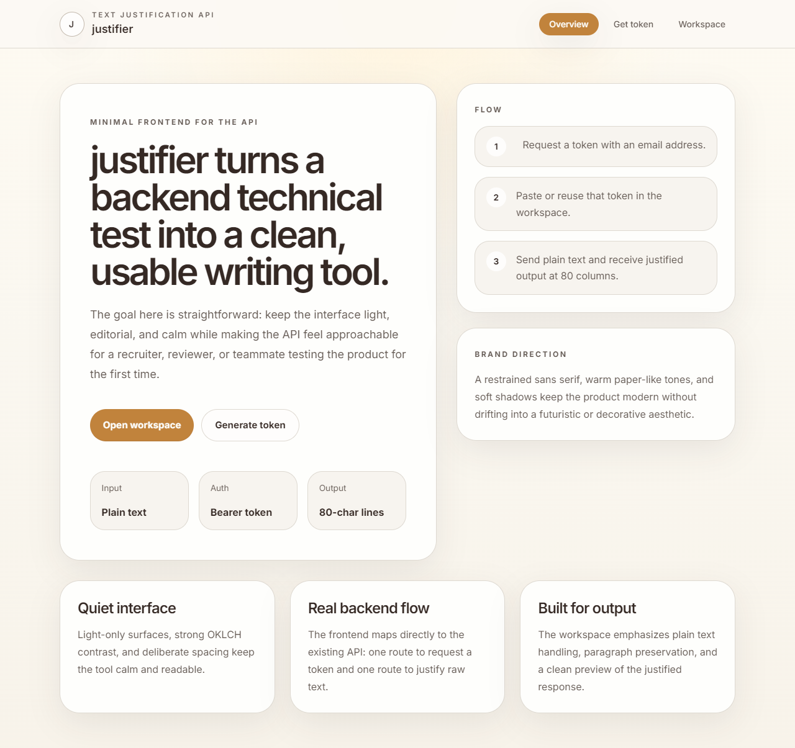
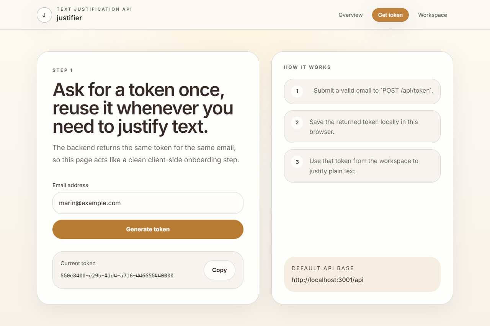
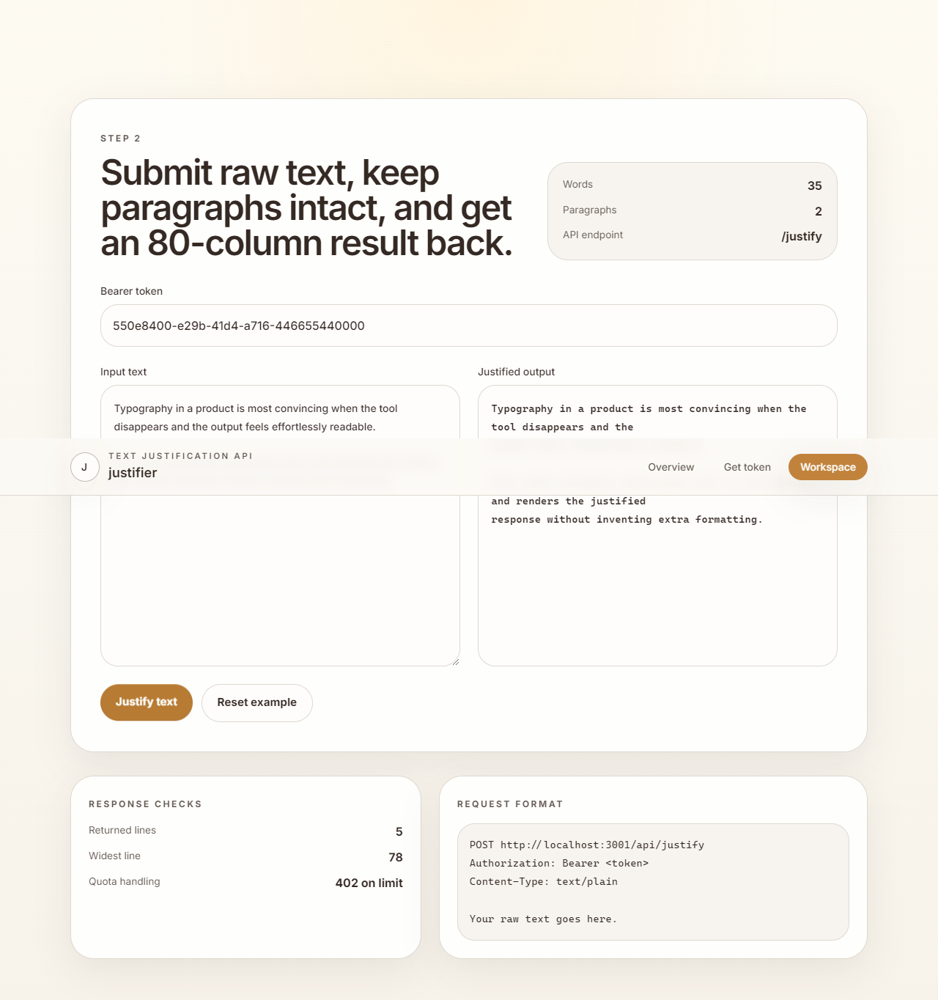

# justifier

`justifier` is a full-stack text justification project built around a NestJS API and a Next.js frontend. The backend exposes a token endpoint plus a protected `text/plain` justification endpoint, and the frontend wraps that flow in a calm, light-only UI designed to feel polished during a technical review.

## What it does

- Requests a reusable bearer token from `POST /api/token`
- Sends raw text to `POST /api/justify`
- Preserves paragraph breaks
- Returns text justified to 80 characters per line
- Enforces a rolling 24-hour quota of 80,000 words per token

## Frontend

The frontend lives in [`frontend`](./frontend) and is built with Next.js App Router.

- Light mode only
- Minimalist editorial UI
- OKLCH color system with strong contrast
- Sans serif typography and restrained spacing
- Three routes: overview, token flow, and justification workspace

### Screens

#### Home



#### Token



#### Workspace



### Frontend commands

```bash
cd frontend
npm install
npm run dev
```

Optional environment variable:

```bash
NEXT_PUBLIC_API_BASE_URL=http://localhost:3001/api
```

### Frontend verification

```bash
cd frontend
npm run lint
npm run build
npm run test:e2e
npm run screenshots
```

The screenshot command writes the README assets to [`frontend/docs/screenshots`](./frontend/docs/screenshots).

## Backend

The backend lives in [`backend`](./backend) and is built with NestJS.

### API routes

#### `POST /api/token`

Request body:

```json
{
  "email": "user@example.com"
}
```

Response:

```json
{
  "token": "uuid-token"
}
```

#### `POST /api/justify`

Headers:

```text
Authorization: Bearer <token>
Content-Type: text/plain
```

Body:

```text
Raw text to justify
```

Responses:

- `200` justified text
- `400` missing or empty text
- `401` missing or invalid token
- `402` daily quota exceeded

### Backend commands

```bash
cd backend
npm install
npm run start:dev
```

Swagger docs are exposed at `http://localhost:3001/api/docs`.

## Testing

Backend coverage includes unit and e2e tests.

```bash
cd backend
npm test
npm run test:e2e
```

Frontend coverage includes linting, production build validation, Playwright e2e checks, and screenshot generation.

## Notes

- Tokens and quotas are stored in memory, so they reset when the backend restarts.
- The quota window is fixed to 24 hours from first usage for a given token.
- The frontend tests mock API responses so UI verification stays fast and repeatable.
